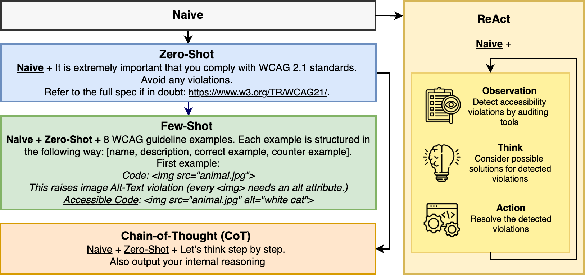

# Generating Code, Ignoring Accessibility: An Empirical Study of MLLM-Generated Web UIs


## Abstract
As multimodal large language models (MLLMs) increasingly support UI code generation from visual inputs
such as screenshots, their role in accelerating web development is growing. While prior work has focused on generating functional and visually accurate code, the accessibility of such code remains underexplored. In this paper, we conduct the first empirical study of accessibility in MLLM-generated HTML/CSS code from UI screenshots. We evaluate multiple state-of-the-art MLLMs with different prompting strategies, across benchmark, synthetic, and real-world datasets. Our study investigates four research questions: (1) whether MLLMs can generate accessible code by default, (2) how model differences impact accessibility outcomes, (3) whether advanced prompting techniques improve accessibility, and (4) whether potential training data leakage exists and how it affects accessibility evaluation. Our findings reveal that, despite strong performance in code fidelity, MLLMs often overlook critical accessibility requirements. We identify common violations, analyze prompting effects, and discuss implications for model training, evaluation, and human-AI collaboration. Based on these insights, we outline future research directions for building more inclusive and accessible AI-driven UI development workflows.


## Overview Prompts



## Repository Structure
| Path                | Description                                      |
|---------------------|--------------------------------------------------|
| `Data/Analysis/`    | Tools for analysis of MLLM-generated code         |
| `Data/Input/`       | Benchmark dataset                                |
| `Data/Output/`      | Outputs of MLLMs (HTML/CSS, screenshots, reports)|
| `Data_leakage_test/`| Synthetic + Fresh datasets (data leakage study)  |
| `LLMs/`             | Model client strategies                          |
| `Results/`          | Aggregated results (accessibility & benchmarks)  |
| `Utils/`            | Utility functions                                |
| `pipeline.py`       | Main pipeline for processing & evaluation        |
| `requirements.txt`  | Python dependencies                              |
| `README.md`         | Project documentation                            |


## Quickstart
1. Clone the repository

2. Install dependencies
```bash
# Install dependencies
pip install -r requirements.txt
```

3. Create a keys.json file in the root directory with your API keys:
```json
{
  "openai": {
    "api_key": "your_openai_api_key"
  },
  "gemini": {
    "api_key": "your_gemini_api_key"
  }
}
```
Background: LlaVa and Qwen have been run locally, thus their API keys are not required.

4. Run the main pipeline
The main entry point is [`pipeline.py`](./pipeline.py).  
It processes all UI screenshots in `Data/Input/images/`, sends them to the selected model, 
and evaluates the generated HTML/CSS with automated accessibility tools.

You can control the execution with the following arguments:

| Argument | Values | Default | Description |
|----------|--------|---------|-------------|
| `--model`, `-m` | `openai`, `gemini`, `qwen`, `llava` | `openai` | Choose which MLLM to evaluate. |
| `--prompt_strategy`, `-p` | `naive`, `zero-shot`, `few-shot`, `reason` | `naive` | Prompting technique used. |
| `--date`, `-d` | `YYYY-MM-DD-HH-MM` | current datetime | Timestamp for this run (used in output folders - default: current date). |
| `--improvement_strategy`, `-i` | `iterative` | None | Optional strategies to refine accessibility of the generated code. Iterative refers to the ReAct prompting technique. |
| `--starting_from`, `-sf` | integer (e.g., 10) | 0 | Start processing from this file index (e.g., skip 0–9.png). |

### Examples

Run OpenAI GPT-4o with naive prompting:
```bash
python pipeline.py -m openai -p naive
```
Run Gemini with naive prompting, iterative (ReAct) improvements:
```bash
python pipeline.py -m gemini -p naive -i iterative
```

Resume from the 50th input image using Qwen:
```bash
python pipeline.py -m qwen -p reason -sf 50
```
Outputs will be written to:
Data/Output/<model>/html/<prompt_strategy>/<date>/
Results summaries in Results/


5. Aggregating Results (Averages)
Each (model, prompt) configuration is evaluated in **3 independent rounds**, each on 53 images.  
To reproduce the numbers reported in the paper (e.g., Table 3), the results of these rounds must be averaged.

We provide a script [`Data/Analysis/calculateAverages.py`](./Data/Analysis/calculateAverages.py)  
to automatically compute average accessibility and benchmark results.

### Usage

```bash
python Data/Analysis/calculateAverages.py \
  --model gemini \
  --prompt_strategy naive
```